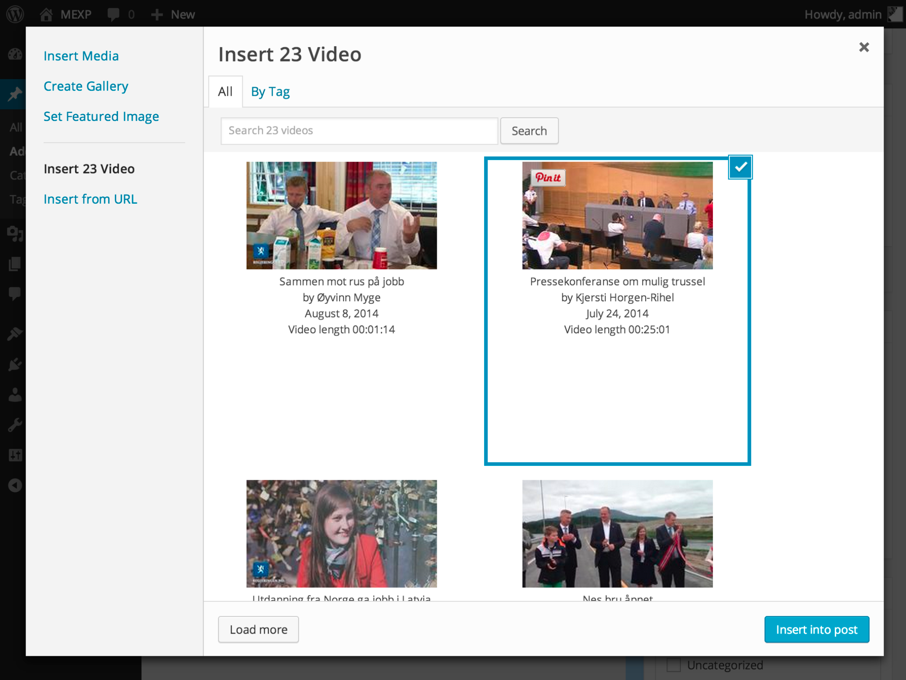

<!-- DO NOT EDIT THIS FILE; it is auto-generated from readme.txt -->
# MEXP 23

[23 Video](http://www.23video.com/) extension for WordPress Media Explorer.

* **Contributors:** [soderlind](http://profiles.wordpress.org/pers)
* **Tags:** [media explorer](http://wordpress.org/plugins/tags/media explorer), [mexp](http://wordpress.org/plugins/tags/mexp), [media](http://wordpress.org/plugins/tags/media)
* **Requires at least:** 3.6
* **Tested up to:** 3.9.2
* **License:** [GPLv2 or later](http://www.gnu.org/licenses/gpl-2.0.html)

## Description ##

This plugin is an extension for WordPress [Media Explorer](https://github.com/Automattic/media-explorer/) plugin that adds 23 Video service.
This extension allows user to search vidoes from 23 Video by text and tag.

**Development of this plugin is done [on GitHub](https://github.com/soderlind/mexp-23). Pull requests welcome.**

## Requirements and prerequisites ##

Install and activate the WordPress [Media Explorer](https://github.com/Automattic/media-explorer/) plugin. You can use the MEXP 23 settings page (`Settings->23 Video`) to disable the services included with Media Explorer.

## Installation ##

To clone the plugin, including the `lib` [submodule](https://github.com/soderlind/class-wp-23-video), you need to use the git `--recursive` parameter:  `git clone --recursive https://github.com/soderlind/mexp-23.git`

Upload MEXP 23 plugin to your blog's `wp-content/plugins/` directory and activate.

The plugin is also available from the [WordPress plugin directory](http://wordpress.org/plugins/mexp-23/).

## Screenshots ##

### Search videos from 23 Video within media explorer

### Add credentials in the 23 Video settings page

## Changelog ##

### 0.1.2 ###

* Added languages/mexp-23-LANG.po

### 0.1.1 ###

* Updated submodule lib/class-wp-23-video.php, changed code for oauth_nonce

### 0.1.0 ###

* Initial release

## Credits ##

I learned a lot, and borrowed code, from [MEXP Picasa](https://github.com/gedex/mexp-picasa) and [MEXP Flickr](https://github.com/gedex/mexp-flickr).

